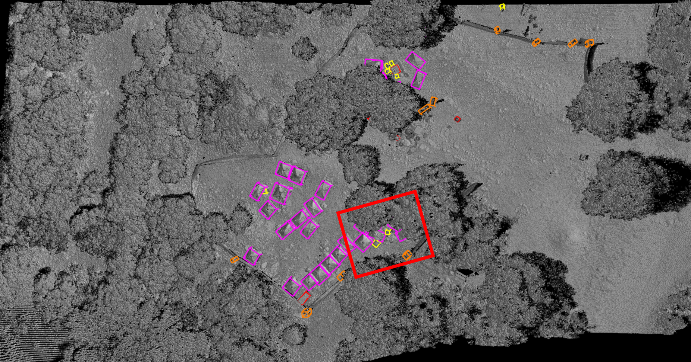
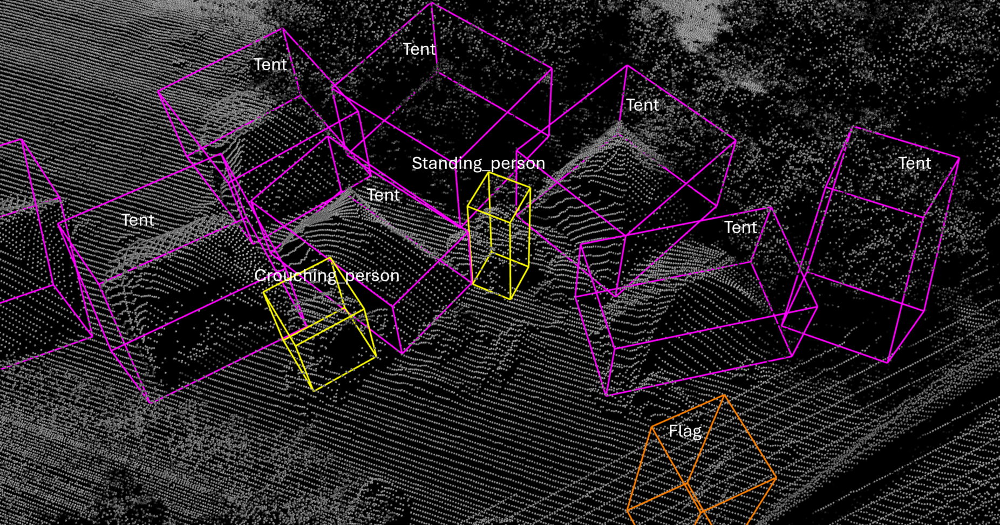

# WiSAR3D

<p align="center">
  <a href="https://wisar3d.github.io/" style="margin-right: 8px;">
    
  </a>
  <a href="https://arxiv.org/abs/xxxx.xxxxx" style="margin-right: 8px;">
    
  </a>
  <a href="https://cgmdata.ece.technion.ac.il/public/data/WiSAR3D/">
    
  </a>
</p>

This is the official code for the [WiSAR3D (WACV 2026)]() paper.

<table>
  <tr>
    <td style="text-align: center;">
      
      <br>(a) A typical scene
    </td>
    <td style="text-align: center;">
      
      <br>(b) Zoom in on the red rectangle
    </td>
  </tr>
</table>


## Detection results

We incorporated state-of-the-art detectors from autonomous driving datasets. 
The table presents the outcomes of our five metrics, as well as the training duration in hours measured on `8× A100 GPUs`, the FPS (frames per second) at inference measured on a single A100 GPU with a batch size of 1, and the memory usage per GPU during training and inference.

| Method                                                                              | mAP↑    | NDS↑    | ATE↓     | ASE↓     | AOE↓     | Training Time [h]↓   | FPS↑    | Training Memory [GB]↓ | Inference Memory [GB]↓ |
|-------------------------------------------------------------------------------------|---------|---------|----------|----------|----------|----------------------|---------|------------------------|------------------------|
| [PointPillars](tools/cfgs/wisar3d_models/pointpillar.yaml)                          | 0.3592  | 0.5079  | 0.1547   | 0.1982   | 0.6774   | 1.92                 | 9.43    | 38.39                  | 8.64                   |
| [PointRCNN](tools/cfgs/wisar3d_models/pointrcnn.yaml)                               | 0.4163  | 0.5276  | 0.2903   | 0.3355   | 0.4577   | 11.63                | 0.23    | 35.18                  | **4.04**               |
| [PV-RCNN](tools/cfgs/wisar3d_models/pv_rcnn_with_centerhead_rpn.yaml)               | 0.5043  | 0.6254  | 0.1782   | 0.2345   | 0.3478   | 24.10                | 0.24    | **17.45**              | 6.62                   |
| [Voxel-RCNN](tools/cfgs/wisar3d_models/voxel_rcnn_with_centerhead_dyn_voxel.yaml)   | 0.5062  | 0.6382  | 0.1721   | 0.2297   | 0.2880   | **1.63**             | **10.22** | 17.67                | 6.09                   |
| [CenterPoint](tools/cfgs/wisar3d_models/centerpoint.yaml)                           | 0.6076  | 0.7146  | 0.0853   | 0.1570   | 0.2928   | 1.97                 | 7.43    | 20.17                  | 5.16                   |
| [VoxelNeXt2d](tools/cfgs/wisar3d_models/voxelnext2d.yaml)                           | 0.5805  | 0.7127  | 0.1036   | 0.1476   | **0.2141** | 2.13               | 7.22    | 51.13                  | 11.82                  |
| [VoxelNeXt](tools/cfgs/wisar3d_models/voxelnext_large.yaml)                         | 0.6394  | 0.7426  | **0.0779** | 0.1468 | 0.2378   | 3.37                 | 4.55    | 47.61                  | 16.13                  |
| [DSVT (Voxel)](tools/cfgs/wisar3d_models/dsvt_voxel.yaml)                           | 0.6527  | **0.7475** | 0.0814 | **0.1454** | 0.2466 | 2.90                 | 4.90    | 79.04                  | 35.88                  |
| [HEDNet](tools/cfgs/wisar3d_models/hednet.yaml)                                     | **0.6654** | 0.7421 | 0.0909 | 0.1540   | 0.2985   | 1.98                 | 7.41    | 52.05                  | 28.69                  |


## Installation

### Requirements
The codes were tested in the following environment:
* Ubuntu 20.04
* Python 3.8
* PyTorch 1.9
* CUDA 11.1

Create an environment: 
```
conda create -n env_wisar3d python=3.8
conda activate env_wisar3d
pip install torch==1.9.0+cu111 torchvision==0.10.0+cu111 torchaudio==0.9.0 -f https://download.pytorch.org/whl/torch_stable.html
```

Install the required dependency packages using pip. We provide a requirements.txt file to help configure the environment.

Install this pcdet library and its dependent libraries by running the following:
```
python setup.py develop
```


## Data preparation 
Download the [WiSAR3D](https://cgmdata.ece.technion.ac.il/public/data/WiSAR3D/) dataset, extract and organize the files as follows:
```
WiSAR3D
├── data
│   ├── wisar3d
│   │   │── ImageSets
│   │   │── training
│   │   │   ├── points
│   │   │   │   ├── 000000.npy
│   │   │   │   ├── 000001.npy
│   │   │   │   ├── ...
│   │   │   ├── label
│   │   │   │   ├── 000000.txt
│   │   │   │   ├── 000001.txt
│   │   │   │   ├── ...
│   │   │── gt_database
│   │   │── wisar3d_dbinfos_train.pkl
│   │   │── wisar3d_infos_train.pkl
│   │   │── wisar3d_infos_val.pkl
├── pcdet
├── tools
├── ...
```
To generate the data infos and gt database, run the following command:
```
python -m pcdet.datasets.wisar3d.wisar3d_dataset create_wisar3d_infos tools/cfgs/dataset_configs/wisar3d_dataset.yaml
```


## Training & Evaluation

* Train with a single GPU:
```
python train.py --cfg_file ${CONFIG_FILE}
```
* Train with multiple GPUs:
```
bash scripts/dist_train.sh ${NUM_GPUS} --cfg_file ${CONFIG_FILE}
# can add extra command line parameters:
bash scripts/dist_train.sh 8 --cfg_file cfgs/wisar3d_models/centerpoint.yaml --batch_size 16 --epochs 80 --extra_tag centerpoint
```

* Evaluate a pretrained model with a single GPU:
```
python test.py --cfg_file ${CONFIG_FILE} --batch_size ${BATCH_SIZE} --ckpt ${CKPT}
```
* Evaluate with multiple GPUs:
```
bash scripts/dist_test.sh ${NUM_GPUS} --cfg_file ${CONFIG_FILE} --batch_size ${BATCH_SIZE}
```


## Citation

TBD


## Acknowledgement
Our codes are based on [OpenPCDet](https://github.com/open-mmlab/OpenPCDet) and [HEDNet](https://github.com/zhanggang001/HEDNet).


